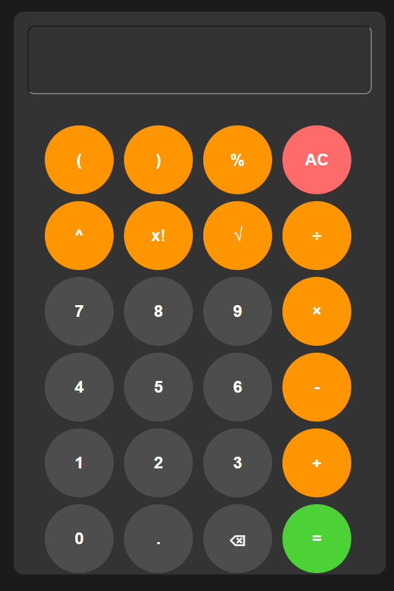
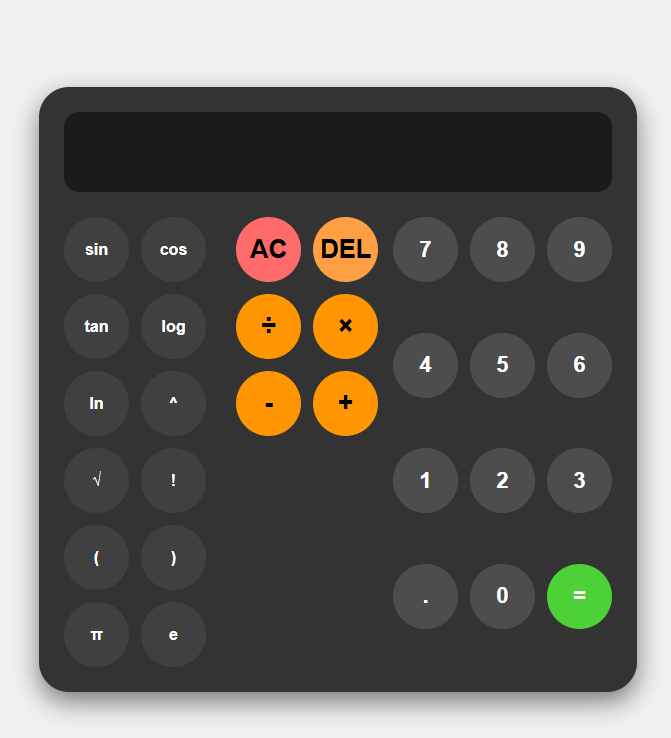
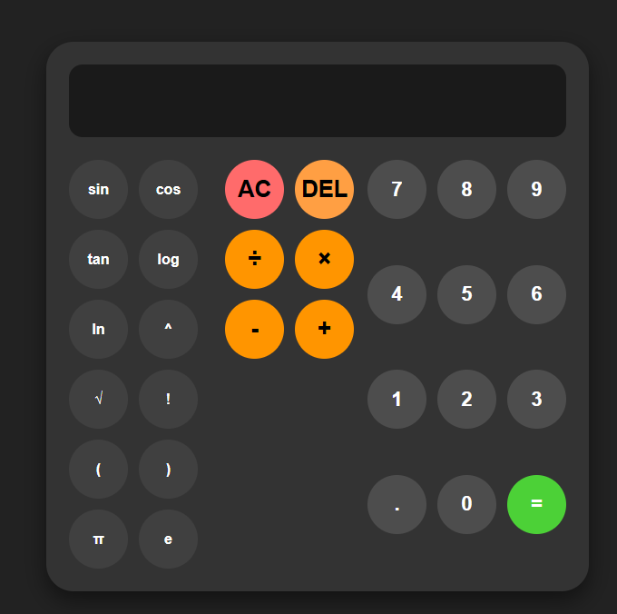
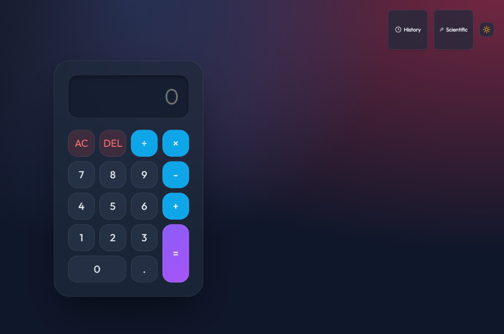
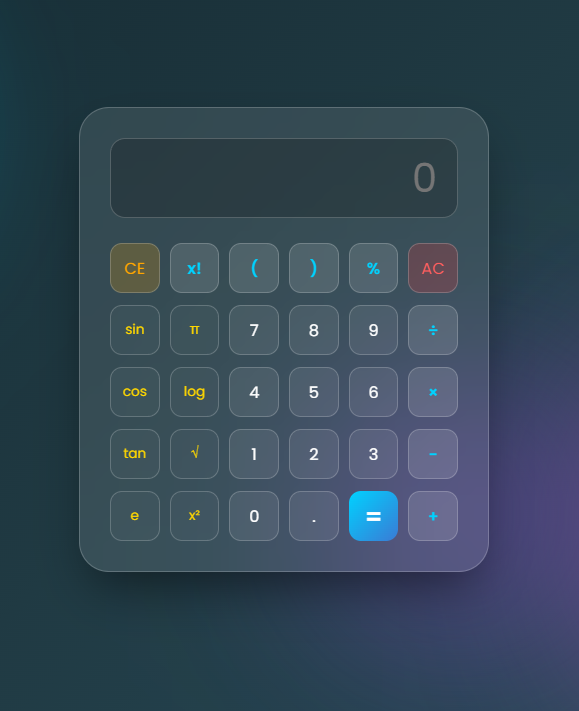

<h2 align="center">Calculator-1 Theme</h2>

<table align="center">
  <tr>
    <td align="center">
      
       
      <em>Light Mode</em>
    </td>
    <td align="center">
      
       
      <em>Dark Mode</em>
    </td>
  </tr>
</table>

<h2 align="center">Calculator-2 Theme</h2>

<table align="center">
  <tr>
    <td align="center">
      
       
      <em>Light Mode</em>
    </td>
    <td align="center">
      
       
      <em>Dark Mode</em>
    </td>
  </tr>
</table>

<h2 align="center">Calculator-3 Theme</h2>

<table align="center">
  <tr>
    <td align="center">
      
       
      <em>Standard Mode</em>
    </td>
    <td align="center">
      
       
      <em>Scientific Mode</em>
    </td>
  </tr>
  <tr>
    <td align="center" colspan="2">
      
       
      <em>Glassmorphism Theme</em>
    </td>
  </tr>
</table>
