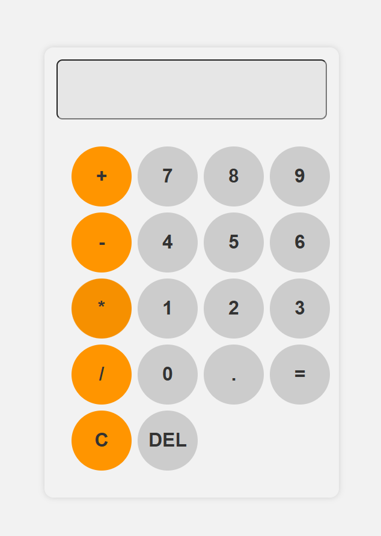

<h2 align="center">Calculator Theme</h2>

<table align="center">
  <tr>
    <td align="center">
      
       
      <em>Light Mode</em>
    </td>
    <td align="center">
      
       
      <em>Dark Mode</em>
    </td>
  </tr>
</table>
